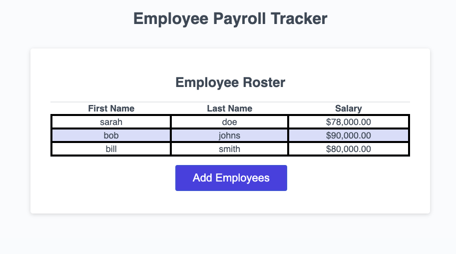

# Employee Payroll Tracker 
 

## Description
This [application](https://nvanschaack.github.io/employee-payroll-tracker/) allows a payroll manager to enter in their employees information (name and salary) and view this information in a table. This way, the manager can see all of their employees' names and salaries listed one place. 

## Technologies Used
- CSS3
- HTML5
- JavaScript (ES6+)

## Usage
In this application, you will be able to plug in employees data by a prompt that will appear once you click the "Add Employees" button. Once you are done adding every name and salary you wish to add, you will click the "Cancel" button which means you wish to add no more employees to your roster. All the names and respective salaries will then be listed under the "Employee Roster" heading for easy viewing. If you wish to view the average of the salaries, open the console log. You will also notice that a random employee name has been generated and selected as the lucky winner for a prize!

## Credits
- Collaboration with tutor, Vinnie Lopez (jlopez@instructors.2u.com)

## License
Please refer to the LICENSE in the repo.